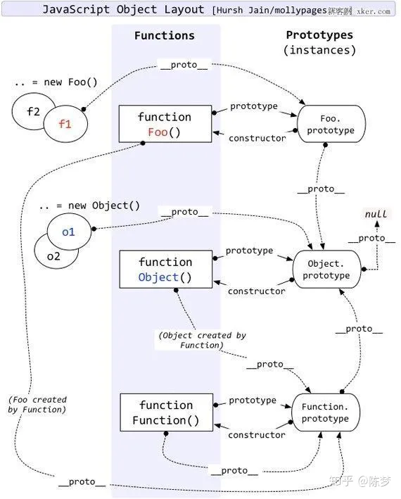
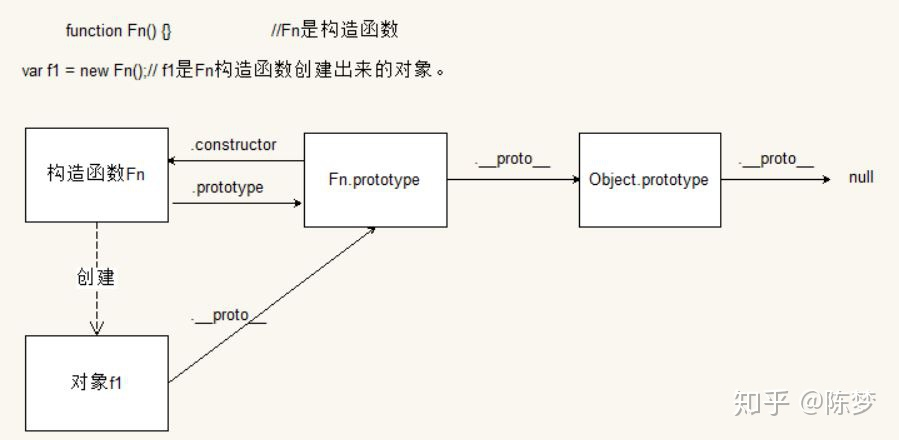
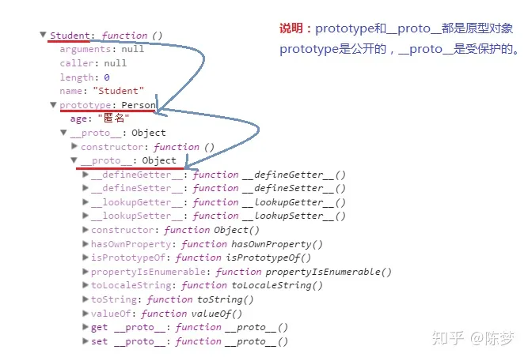

```javascript
var person = {
    stu:["x","y","z"]
}
// Object.create() 方法用于创建一个新对象，使用现有的对象来作为新创建对象的原型（prototype）。
var p1 = Object.create(person);
p1.stu.push("A");

console.log(person.stu);
```

```js
// 类继承
// Shape - superclass
function Shape() {
  this.x = 0;
  this.y = 0;
}

// superclass method
Shape.prototype.move = function(x, y) {
  this.x += x;
  this.y += y;
  console.info('Shape moved.');
};

// Rectangle - subclass
function Rectangle() {
  Shape.call(this); // call super constructor.
}

// subclass extends superclass
Rectangle.prototype = Object.create(Shape.prototype);

//If you don't set Rectangle.prototype.constructor to Rectangle,
//it will take the prototype.constructor of Shape (parent).
//To avoid that, we set the prototype.constructor to Rectangle (child).
Rectangle.prototype.constructor = Rectangle;

const rect = new Rectangle();

console.log('Is rect an instance of Rectangle?', rect instanceof Rectangle); // true
console.log('Is rect an instance of Shape?', rect instanceof Shape); // true
rect.move(1, 1); // Outputs, 'Shape moved.'

```
优点：方法复用
- 由于方法定义在父类的原型上，复用了父类构造函数原型上的方法。

缺点：
- 创建的子类实例不能传参。
- 子类实例共享了父类构造函数的引用属性（如：arr）。


1.首先原型是什么？

- 在JavaScript中原型是一个prototype对象，用于表示类型之间的关系。
- 用途： 为每个实例对象存储共享的方法和属性
- 只是一个普通对象
- 所有实例共享同一个原型对象，因此跟实例方法或属性不一样，原型对象仅有一份。

2.原型链又是什么？

JavaScript万物都是对象，对象和对象之间也有关系，并不是孤立存在的。

- 对象之间的继承关系，在JavaScript中是通过prototype对象指向父类对象，直到指向Object对象为止，这样就形成了一个原型指向的链条，专业术语称之为原型链。

function Fn() {}// Fn为构造函数
var f1 = new Fn();//f1是Fn构造函数创建出来的对象

- 构造函数的prototype属性值就是对象原型。（Fn.prototype就是对象的原型）
- 构造函数的prototype属性值的类型就是对象 typeof Fn.prototype==='object'
- 对象原型中的constructor属性指向构造函数 （Fn.prototype.constructor===Fn)
- 对象的__proto__属性值就是对象的原型。（f1.__proto__就是对象原型）
Fn.prototype===f1.__proto__ 其实它们两个就是同一个对象---对象的原型。
所有Fn.prototype.__proto__=== Object.prototype
typeof Object.prototype ===object。
Object.prototype.__proto__===null。

我讨论原型就是指的对象与原型对象之间的关系。所以原型链也称之为对象链。




原型链指向为：f1.__proto__---->Fn.prototype.__proto__----->Object.prototype.__prototype__---->null

从一开始的f1的prototype一直向上指直到Object结束，Object的__proto__指向null



总结：函数的原型对象constructor默认指向函数本身，原型对象除了有原型属性外，为了实现继承，还有一个原型链指针__proto__，该指针指向上一层的原型对象，而上一层的原型对象的结构依然类似，这样利用__proto__一直指向Object的原型对象上，而Object的原型对象用Object.prototype.__proto__ = null表示原型链的最顶端，如此变形成了javascript的原型链继承，同时也解释了为什么所有的javascript对象都具有Object的基本方法。